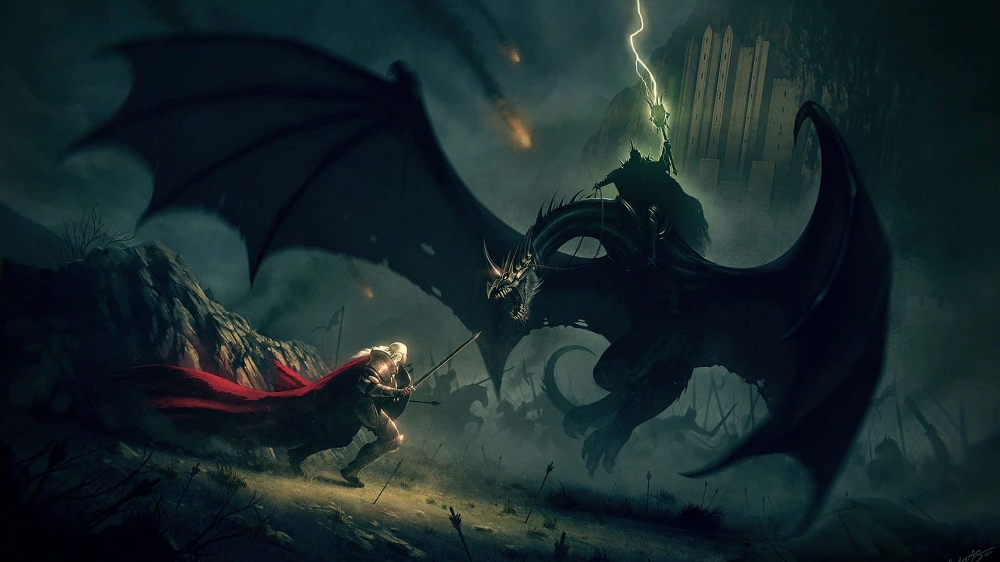

# 🧙‍♂️ LordOfTheBots: Your Middle-earth Guide 🧝‍♀️

## 📜 Overview

Welcome to **LordOfTheBots** - your ultimate companion through the realms of Middle-earth! This AI chatbot has been forged in the fires of Mount Doom (or rather, with OpenAI and Hugging Face) to answer all your burning questions about J.R.R. Tolkien's legendary world of "The Lord of the Rings" - from the books to Peter Jackson's epic film trilogy.

*"Not all those who wander are lost, but those who have questions about Middle-earth have found the right bot!"*

## ✨ Features

- 🔮 **All-knowing Middle-earth Expert**: Ask anything about characters, places, events, lore, and behind-the-scenes trivia
- 🧠 **Powered by GPT-4o**: Utilizes OpenAI's advanced language model for natural conversations
- 📚 **RAG Architecture**: Retrieval Augmented Generation ensures accurate information based on Wikipedia sources
- 🗃️ **Chroma Vector Database**: Efficiently stores and retrieves knowledge about Middle-earth
- 🤗 **Hugging Face Embeddings**: Uses open-source models for semantic understanding
- 🔗 **LangChain Framework**: Connects all components seamlessly
- 🌈 **Streamlit Interface**: User-friendly GUI for easy interaction

## 🛠️ Technology Stack

- **LLM**: OpenAI GPT-4o
- **Embeddings**: Hugging Face open-source models
- **Vector Database**: Chroma
- **Framework**: LangChain
- **Knowledge Source**: Wikipedia pages on LOTR books and movies
- **Frontend**: Streamlit

## 🚀 Coming Soon

This README will be updated with:
- Installation instructions
- Usage examples
- Code snippets
- Deployment guides
- Contribution guidelines

## 💍 One Bot to Rule Them All

LordOfTheBots doesn't simply answer your questions - it transports you to Middle-earth with its deep knowledge and engaging responses. Whether you're curious about the Silmarils, wondering about Tom Bombadil's true nature, or debating why one does not simply walk into Mordor, this bot has the answers you seek!

---

*"It's a dangerous business, Frodo, going out your door. You step onto the road, and if you don't keep your feet, there's no knowing where you might be swept off to... unless you have LordOfTheBots as your guide!"*

---

⚔️ Project by [STRH] - The fellowship awaits your code contributions! ⚔️